# Teaching-HEIGVD-SRX-2021-Labo-VPN

**Ce travail de laboratoire est à faire en équipes de 2 personnes**

**Pour ce travail de laboratoire, il est votre responsabilité de chercher vous-même sur internet, le support du cours ou toute autre source (vous avez aussi le droit de communiquer avec les autres équipes), toute information relative au sujet VPN, le logiciel eve-ng, les routeur Cisco, etc que vous ne connaissez pas !**

**ATTENTION : Commencez par créer un Fork de ce répo et travaillez sur votre fork.**

Clonez le répo sur votre machine. Vous pouvez répondre aux questions en modifiant directement votre clone du README.md ou avec un fichier pdf que vous pourrez uploader sur votre fork.

**Le rendu consiste simplement à répondre à toutes les questions clairement identifiées dans le text avec la mention "Question" et à les accompagner avec des captures. Le rendu doit se faire par une "pull request". Envoyer également le hash du dernier commit et votre username GitHub par email au professeur et à l'assistant**

**N'oubliez pas de spécifier les noms des membres du groupes dans la Pull Request ainsi que dans le mail de rendu !!!**


## Echéance 

Ce travail devra être rendu au plus tard, **le 3 juin 2021, à 23h59.**


## Introduction

Dans ce travail de laboratoire, vous allez configurer des routeurs Cisco émulés, afin de mettre en œuvre une infrastructure sécurisée utilisant des tunnels IPSec.

### Les aspects abordés

-	Contrôle de fonctionnement de l’infrastructure
-	Contrôle du DHCP serveur hébergé sur le routeur
-	Gestion des routeurs en console
-	Capture Sniffer avec filtres précis sur la communication à épier
-	Activation du mode « debug » pour certaines fonctions du routeur
-	Observation des protocoles IPSec
 
 
## Matériel

Le logiciel d'émulation à utiliser c'est eve-ng (vous l'avez déjà employé). Vous trouverez ici un [guide très condensé](files/Manuel_EVE-NG.pdf) pour l'utilisation et l'installation de eve-ng.

Vous pouvez faire fonctionner ce labo sur vos propres machines à condition de copier la VM eve-ng. A présent, la manière la plus simple d'utiliser eve-ng est de l'installer sur Windows (mais, il est possible de le faire fonctionner sur Mac OS et sur Linux...). **Si vous avez toujours la VM eve-ng que vous avez utilisée dans un cours précédant, cela devrait fonctionner aussi et vous n'avez donc pas besoin de récupérer une nouvelle version.**

**Récupération de la VM pré-configurée** (vous ne pouvez pas utiliser la versión qui se trouve sur le site de eve-ng) : comme indiqué dans le [manuel](files/Manuel_EVE-NG.pdf) vous la trouverez sur [ce lien switch drive](https://drive.switch.ch/index.php/s/4KtTNwzxbF94P1d).

Il est conseillé de passer la VM en mode "Bridge" si vous avez des problèmes. Le mode NAT **devrait** aussi fonctionner.

Les user-password en mode terminal sont : "root" | "eve"

Les user-password en mode navigateur sont : "admin" | "eve"

Ensuite, terminez la configuration de la VM, connectez vous et récupérez l'adresse ip de la machine virtuelle.

Utilisez un navigateur internet (hors VM) et tapez l'adresse IP de la VM.


## Fichiers nécessaires 

Tout ce qu'il vous faut c'est un [fichier de projet eve-ng](files/eve-ng_Labo_VPN_SRX.zip), que vous pourrez importer directement dans votre environnement de travail.


## Mise en place

Voici la topologie qui sera simulée. Elle comprend deux routeurs interconnectés par l'Internet. Les deux réseaux LAN utilisent les services du tunnel IPSec établi entre les deux routeurs pour communiquer.

Les "machines" du LAN1 (connecté au ISP1) sont simulées avec l'interface loopback du routeur. Les "machines" du LAN2 sont représentées par un seul ordinateur.  


Voici le projet eve-ng utilisé pour implémenter la topologie. Le réseau Internet (nuage) est simulé par un routeur. 


## Manipulations

- Commencer par importer le projet dans eve-ng.
- Prenez un peu de temps pour vous familiariser avec la topologie présentée dans ce guide et comparez-la au projet eve-ng. Identifiez les éléments, les interconnexions et les adresses IP.
- À tout moment, il vous est possible de sauvegarder la configuration dans la mémoire de vos routeurs :
	- Au Shell privilégié (symbole #) entrer la commande suivante pour sauvegarder la configuration actuelle dans la mémoire nvram du routeur : ```wr```
	- Vous **devez** faire des sauvegardes de la configuration (exporter) dans un fichier - c.f. [document guide eve-ng](files/Manuel_EVE-NG.pdf), section 3.2 et 3.3.


### Vérification de la configuration de base des routeurs
Objectifs:

Vérifier que le projet a été importé correctement. Pour cela, nous allons contrôler certains paramètres :

- Etat des interfaces (`show interface`)
- Connectivité (`ping`, `show arp`)
- Contrôle du DHCP serveur hébergé sur R2


### A faire...

- Contrôlez l’état de toutes vos interfaces dans les deux routeurs et le routeur qui simule l'Internet - Pour contrôler l’état de vos interfaces (dans R1, par exmeple) les commandes suivantes sont utiles :

```
R1# show ip interface brief
R1# show interface <interface-name>
R1# show ip interface <interface-name>
```

Un « status » différent de `up` indique très souvent que l’interface n’est pas active.

Un « protocol » différent de `up` indique la plupart du temps que l’interface n’est pas connectée correctement (en tout cas pour Ethernet).

**Question 1: Avez-vous rencontré des problèmes ? Si oui, qu’avez-vous fait pour les résoudre ?**

---

**Réponse :**  

Les configurations semblent OK.

---


- Contrôlez que votre serveur DHCP sur R2 est fonctionnel - Contrôlez que le serveur DHCP préconfiguré pour vous sur R2 a bien distribué une adresse IP à votre station « VPC ».


Les commandes utiles sont les suivantes :

```
R2# show ip dhcp pool 
R2# show ip dhcp binding
```

Côté station (VPC) vous pouvez valider les paramètres reçus avec la commande `show ip`. Si votre station n’a pas reçu d’adresse IP, utilisez la commande `ip dhcp`.

- Contrôlez la connectivité sur toutes les interfaces à l’aide de la commande ping.

Pour contrôler la connectivité les commandes suivantes sont utiles :

```
R2# ping ip-address
R2# show arp (utile si un firewall est actif)
```

Pour votre topologie il est utile de contrôler la connectivité entre :

- R1 vers ISP1 (193.100.100.254)
- R2 vers ISP2 (193.200.200.254)
- R2 (193.200.200.1) vers RX1 (193.100.100.1) via Internet
- R2 (172.17.1.1) et votre poste « VPC »

**Question 2: Tous vos pings ont-ils passé ? Si non, est-ce normal ? Dans ce cas, trouvez la source du problème et corrigez-la.**

---

**Réponse :**  
Les pings ont passé, il a cependent fallu utiliser la commande `ip dhcp` sur VPC pour qu'il reçoive une configuration du DHCP.

---

- Activation de « debug » et analyse des messages ping.

Maintenant que vous êtes familier avec les commandes « show » nous allons travailler avec les commandes de « debug ». A titre de référence, vous allez capturer les messages envoyés lors d’un ping entre votre « poste utilisateur » et un routeur. Trouvez ci-dessous la commande de « debug » à activer.

Activer les messages relatif aux paquets ICMP émis par les routeurs (repérer dans ces messages les type de paquets ICMP émis - < ICMP: echo xxx sent …>)

```
R2# debug ip icmp
```
Pour déclencher et pratiquer les captures vous allez « pinger » votre routeur R1 avec son IP=193.100.100.1 depuis votre « VPC ». Durant cette opération vous tenterez d’obtenir en simultané les informations suivantes :

-	Une trace sniffer (Wireshark) à la sortie du routeur R2 vers Internet. Si vous ne savez pas utiliser Wireshark avec eve-ng, référez-vous au document explicatif eve-ng. Le filtre de **capture** (attention, c'est un filtre de **capture** et pas un filtre d'affichage) suivant peut vous aider avec votre capture : `ip host 193.100.100.1`. 
-	Les messages de R1 avec `debug ip icmp`.


**Question 3: Montrez vous captures**

---

**Screenshots :**  

Sur R1 :
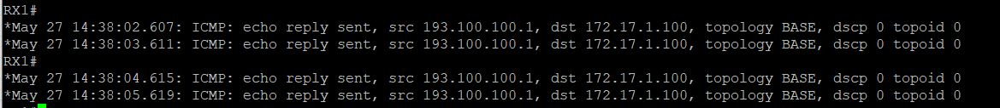

La capture sur le routeur R2 :
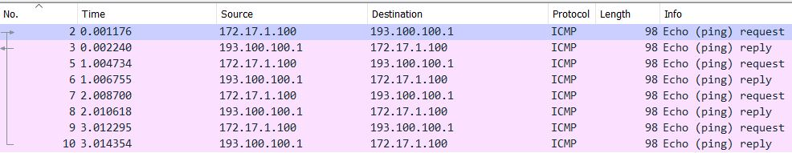

---

## Configuration VPN LAN 2 LAN

**Il est votre responsabilité de chercher vous-même sur internet toute information relative à la configuration que vous ne comprenez pas ! La documentation CISCO en ligne est extrêmement complète et le temps pour rendre le labo est plus que suffisant !**

Nous allons établir un VPN IKE/IPsec entre le réseau de votre « loopback 1 » sur R1 (172.16.1.0/24) et le réseau de votre « VPC » R2 (172.17.1.0/24). La terminologie Cisco est assez « particulière » ; elle est listée ici, avec les étapes de configuration, qui seront les suivantes :

- Configuration des « proposals » IKE sur les deux routeurs (policy)
- Configuration des clefs « preshared » pour l’authentification IKE (key)
- Activation des « keepalive » IKE
- Configuration du mode de chiffrement IPsec
- Configuration du trafic à chiffrer (access list)
- Activation du chiffrement (crypto map)


### Configuration IKE

Sur le routeur R1 nous activons un « proposal » IKE. Il s’agit de la configuration utilisée pour la phase 1 du protocole IKE. Le « proposal » utilise les éléments suivants :

| Element          | Value                                                                                                        |
|------------------|----------------------------------------------------------------------------------------------------------------------|
| Encryption       | AES 256 bits    
| Signature        | Basée sur SHA-1                                                                                                      |
| Authentification | Preshared Key                                                                                                        |
| Diffie-Hellman   | avec des nombres premiers sur 1536 bits                                                                              |
| Renouvellement   | des SA de la Phase I toutes les 30 minutes                                                                           |
| Keepalive        | toutes les 30 secondes avec 3 « retry »                                                                              |
| Preshared-Key    | pour l’IP du distant avec le texte « cisco-1 », Notez que dans la réalité nous utiliserions un texte plus compliqué. |


Les commandes de configurations sur R1 ressembleront à ce qui suit :

```
crypto isakmp policy 20
  encr aes 256
  authentication pre-share
  hash sha
  group 5
  lifetime 1800
crypto isakmp key cisco-1 address 193.200.200.1 no-xauth
crypto isakmp keepalive 30 3
```

Sur le routeur R2 nous activons un « proposal » IKE supplémentaire comme suit :

```
crypto isakmp policy 10
  encr 3des
  authentication pre-share
  hash md5
  group 2
  lifetime 1800
crypto isakmp policy 20
  encr aes 256
  authentication pre-share
  hash sha
  group 5
  lifetime 1800
crypto isakmp key cisco-1 address 193.100.100.1 no-xauth
crypto isakmp keepalive 30 3
```

Vous pouvez consulter l’état de votre configuration IKE avec les commandes suivantes. Faites part de vos remarques :

**Question 4: Utilisez la commande `show crypto isakmp policy` et faites part de vos remarques :**

---

**Réponse :**  

R1 :
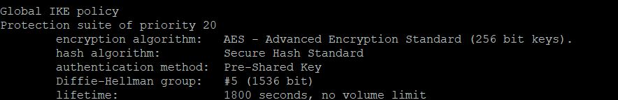

R2 :
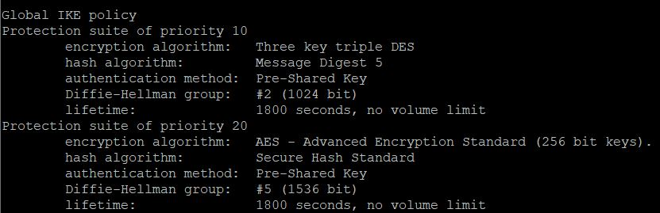

On constate que R1 ne fourni qu'une seule proposal IKE alors que R2 en fourni deux. R2 serait ainsi plus "flexible" dans ses possibilités d'établissement de tunnel VPN.

On constate que chaque proposal décrit :
- Une priorité (1 étant la priorité la plus élevée)
- Une méthode de chiffrement pour la protection des données et ainsi assurer la confidentialité
- Une méthode "Hashed Message Authentication Codes (HMAC)" permettant de s'assurer de l'identité du pair et de l'intégrité des données transportées
- Une méthode d'authentification, pour s'assurer de l'identité du pair
- Un groupe Diffie-Hellman, permettant de déterminer la force de l'algorithme de détermination de la clé de chiffrement. L'algorithme sera utilisé pour dériver la clé de chiffrement
- Une durée de vie de la clé de chiffrement. Après le temps dépassé, il faudra la remplacer

Sources :
- https://www.cisco.com/c/en/us/td/docs/security/security_management/cisco_security_manager/security_manager/4-4/user/guide/CSMUserGuide_wrapper/vpipsec.html

---


**Question 5: Utilisez la commande `show crypto isakmp key` et faites part de vos remarques :**

---

**Réponse :**  

R1 :
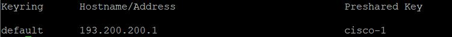

R2 :
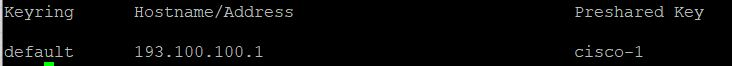

Clé de chiffrement partagée par les deux paires. Dans la réalité, une clé plus robuste serait utilisée.

---

## Configuration IPsec

Nous allons maintenant configurer IPsec de manière identique sur les deux routeurs. Pour IPsec nous allons utiliser les paramètres suivants :

| Paramètre      | Valeur                                  |
|----------------|-----------------------------------------|
| IPsec avec IKE | IPsec utilisera IKE pour générer ses SA |
| Encryption     | AES 192 bits                            |
| Signature      | Basée sur SHA-1                         |
| Proxy ID R1    | 172.16.1.0/24                           |
| Proxy ID R2    | 172.17.1.0/24                           |

Changement de SA toutes les 5 minutes ou tous les 2.6MB

Si inactifs les SA devront être effacés après 15 minutes

Les commandes de configurations sur R1 ressembleront à ce qui suit :

```
crypto ipsec security-association lifetime kilobytes 2560
crypto ipsec security-association lifetime seconds 300
crypto ipsec transform-set STRONG esp-aes 192 esp-sha-hmac 
  ip access-list extended TO-CRYPT
  permit ip 172.16.1.0 0.0.0.255 172.17.1.0 0.0.0.255
crypto map MY-CRYPTO 10 ipsec-isakmp 
  set peer 193.200.200.1
  set security-association idle-time 900
  set transform-set STRONG 
  match address TO-CRYPT
```

Les commandes de configurations sur R2 ressembleront à ce qui suit :

```
crypto ipsec security-association lifetime kilobytes 2560
crypto ipsec security-association lifetime seconds 300
crypto ipsec transform-set STRONG esp-aes 192 esp-sha-hmac 
  mode tunnel
  ip access-list extended TO-CRYPT
  permit ip 172.17.1.0 0.0.0.255 172.16.1.0 0.0.0.255
crypto map MY-CRYPTO 10 ipsec-isakmp 
  set peer 193.100.100.1
  set security-association idle-time 900
  set transform-set STRONG 
  match address TO-CRYPT
```

Vous pouvez contrôler votre configuration IPsec avec les commandes suivantes :

```
show crypto ipsec security-association
show crypto ipsec transform-set
show access-list TO-CRYPT
show crypto map
```

## Activation IPsec & test

Pour activer cette configuration IKE & IPsec il faut appliquer le « crypto map » sur l’interface de sortie du trafic où vous voulez que l’encryption prenne place. 

Sur R1 il s’agit, selon le schéma, de l’interface « Ethernet0/0 » et la configuration sera :

```
interface Ethernet0/0
  crypto map MY-CRYPTO
```

Sur R2 il s’agit, selon le schéma, de l’interface « Ethernet0/0 » et la configuration sera :

```
interface Ethernet0/0
  crypto map MY-CRYPTO
```


Après avoir entré cette commande, normalement le routeur vous indique que IKE (ISAKMP) est activé. Vous pouvez contrôler que votre « crypto map » est bien appliquée sur une interface avec la commande `show crypto map`.

Pour tester si votre VPN est correctement configuré vous pouvez maintenant lancer un « ping » sur la « loopback 1 » de votre routeur RX1 (172.16.1.1) depuis votre poste utilisateur (172.17.1.100). De manière à recevoir toutes les notifications possibles pour des paquets ICMP envoyés à un routeur comme RX1 vous pouvez activer un « debug » pour cela. La commande serait :

```
debug ip icmp
```

Pensez à démarrer votre sniffer sur la sortie du routeur R2 vers internet avant de démarrer votre ping, collectez aussi les éventuels messages à la console des différents routeurs. 

**Question 6: Ensuite faites part de vos remarques dans votre rapport. :**

---

**Réponse :**  

R1 a reçu 3 request (le premier ping a timeout), il a donc répondu avec 3 reply :
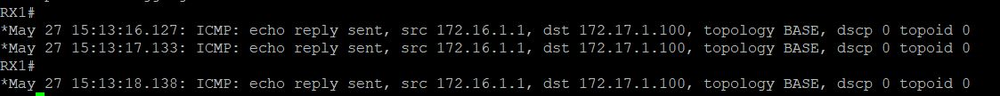

Depuis R2, on peut voir le trafic ISAKMP correspondant aux négociations des SAs et le trafic ESP correspondant aux pings :
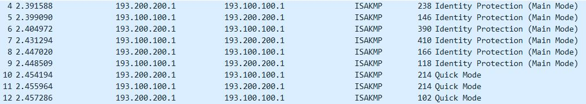


Le trafic ISAKMP avec échange de type **Identity Protection** (IPSec Phase 1) permet de mettre en place un canal sécurisé (authentification des paires) que le trafic ISAKMP **Quick Mode** (IPSec Phase 2) va utiliser pour négocier les SAs.

Les trames ESP (Encapsulating Security Payload) vont contenir les pings encapsulés

Sources :
- http://www.internet-computer-security.com/VPN-Guide/Main-mode.html
- http://www.internet-computer-security.com/VPN-Guide/Quick-Mode.html
- http://www.internet-computer-security.com/VPN-Guide/ESP.html


---

**Question 7: Reportez dans votre rapport une petite explication concernant les différents « timers » utilisés par IKE et IPsec dans cet exercice (recherche Web). :**

---

**Réponse :**  

Les timers permettent de gérer le temps de vie des SAs. Dans notre configuration, les SAs sont renouvellées toutes les 5mn et une SA inutilisée pour 15mn est détruite. Avec ce système, une clé compromise (par bruteforce par exemple) ne pourra déchiffrer des données que pour un temps limité. 

Sources :
- https://networkengineering.stackexchange.com/a/62554
- https://www.cisco.com/c/en/us/td/docs/ios-xml/ios/sec_conn_dplane/configuration/15-mt/sec-ipsec-data-plane-15-mt-book/sec-ipsec-idle-tmrs.pdf

---


# Synthèse d’IPsec

En vous appuyant sur les notions vues en cours et vos observations en laboratoire, essayez de répondre aux questions. À chaque fois, expliquez comment vous avez fait pour déterminer la réponse exacte (capture, config, théorie, ou autre).


**Question 8: Déterminez quel(s) type(s) de protocole VPN a (ont) été mis en œuvre (IKE, ESP, AH, ou autre).**

---

**Réponse :**  

On a pu constater dans les captures de la question 6 que le protocole de négociation était Internet Security Association and Key Management Protocol (ISAKMP), aussi appelé Internet Key Exchange (IKE). Le protocole IPSec Encapsulation Security Payload (ESP) est utilisé pour le chiffrement et l'authentification des paquets de données.

Source :
voir https://www.youtube.com/watch?v=ygbluxxns1U

---


**Question 9: Expliquez si c’est un mode tunnel ou transport.**

---

**Réponse :**  

Dans la configuration de R2, nous avons spécifié le mode tunnel lorsque nous avons configuré le `transform-set`. Nous avons donc un chiffrement et une authentification du paquet IP complet.

Dans le ping de notre exemple précédent, on constate dans les en-têtes des paquets ESP que les IPs sources et destination correpondent à celles des passerelles. Or, le ping était en provenance du VPC à l'adresse 172.17.1.100 :

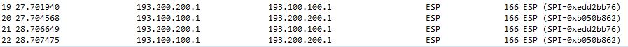

---


**Question 10: Expliquez quelles sont les parties du paquet qui sont chiffrées. Donnez l’algorithme cryptographique correspondant.**

---

**Réponse :**  

Si on reprend l'exemple de notre ping, toute la partie données, entêtes TCP et IP sont chiffrées :


Le chiffrement utilisé est AES sur 192 bit comme configuré dans le `transform-set` des routeurs :

```
crypto ipsec transform-set STRONG esp-aes 192 esp-sha-hmac
```

On peut également que c'est bien cet algorithme de chiffrement qui a été négocié durant la phase 1 d'IKE :

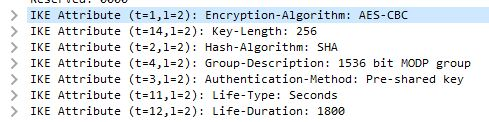

---


**Question 11: Expliquez quelles sont les parties du paquet qui sont authentifiées. Donnez l’algorithme cryptographique correspondant.**

---

**Réponse :**  

Les parties du paquet qui sont authentifiées sont les mêmes que celles qui sont chiffrées en ajoutant l'entête ESP. À noter que l'authentification est optionnelle, comme expliqué dans la théorie :

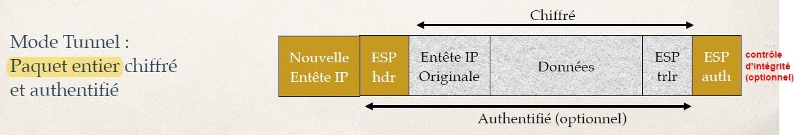

La méthode HMAC utilisée est SHA-1. C'est aussi une information que l'on peut retrouver dans la phase de négociation d'IKE (voir screen question précédente).

---


**Question 12: Expliquez quelles sont les parties du paquet qui sont protégées en intégrité. Donnez l’algorithme cryptographique correspondant.**

---

**Réponse :**  

Les parties du paquet protégées en intégrité sont les mêmes que celles authentifiées, c.-à-d. l'entête ESP, le payload (entêtes, données), et l'enqueue ESP. Ainsi, l'algorithme cryptographique utilisé est le même que pour l'authentification.

Source :
- https://blog.finjan.com/encapsulating-security-protocol/ (section "The ESP Authentication Trailer")

---
